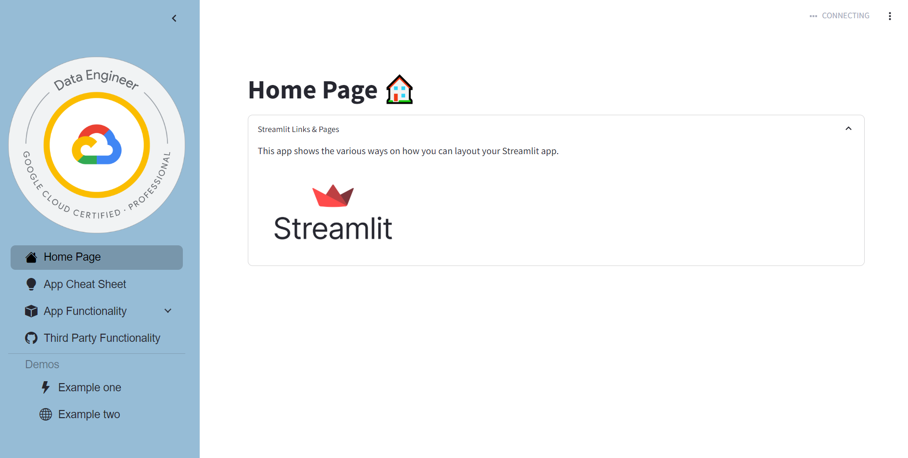
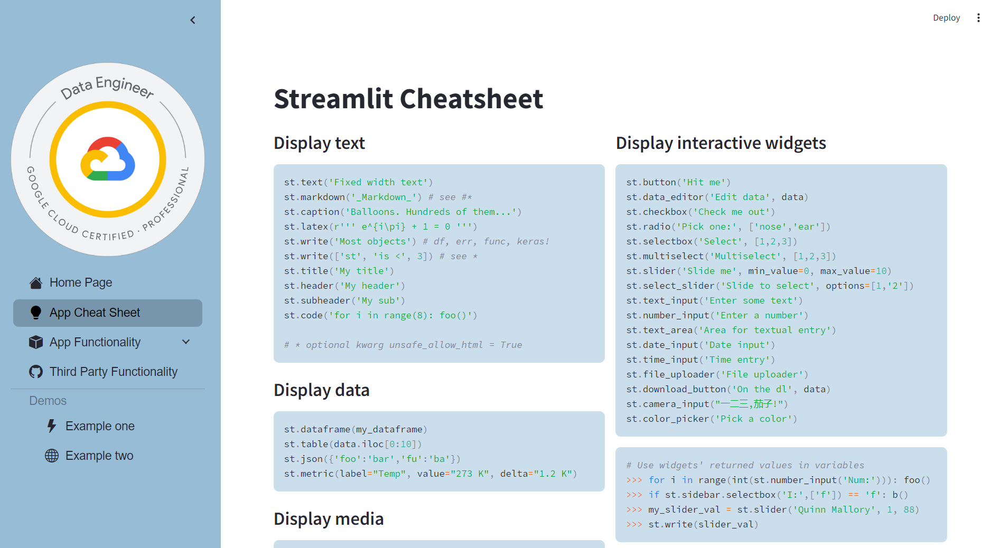

# streamlit-helper

Example Repo for some of the basics of streamlit to get you started with a working repo running locally and in the cloud (GCP). This repo gives you a cheat sheet and examples of the functionality within streamlit including

* Buttons
* Messages
* File upload
* Tables
* Graphs
* Forms
* Chat
* Camera

Use the template code to get started and try the functionality of streamlit from your own machine.

# Getting started Locally

1. Clone this repo
2. Install libraries `pip install -r requirements.txt` - ideally to your own virtual environment
3. Run `streamlit run main.py`
4. Its as easy as that 👨‍💻

## Deploying to GCP

Deploying your streamlit app to gcp can be simple if you know what you are doing... Streamlit has some small issues (related to websockets) when it comes to deplying to app engine, this can can make it slightly more tricky.

This article [here](https://dev.to/whitphx/how-to-deploy-streamlit-apps-to-google-app-engine-407o) written by Yuichiro Tachibana (Tsuchiya) explains the best way to deploy to app engine. However, if you have organisation policies that block external IP Access you will not be able to deploy a flexible environment. This will mean you will need to use Cloud Run.

Whether you use Cloud Run or App Engine it is best to use IAP (Identity Aware Proxy) to secure your app

[Deploying to cloud Run](deploying_to_cloud_run.md){ .md-button .md-button--primary }

[Deploying to App Engine](deploying_to_app_engine.md){ .md-button .md-button--primary }